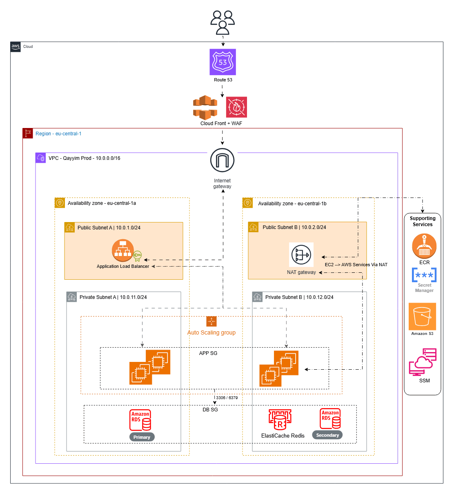
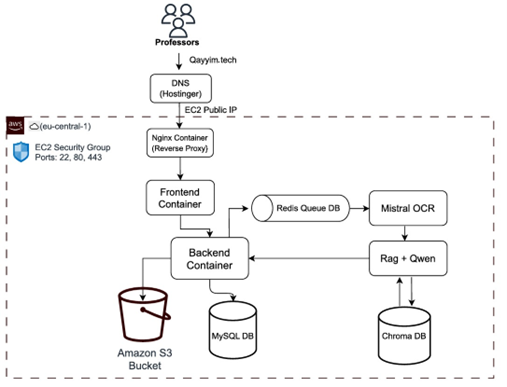
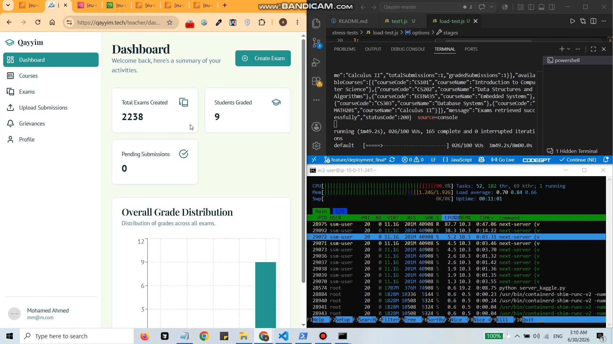
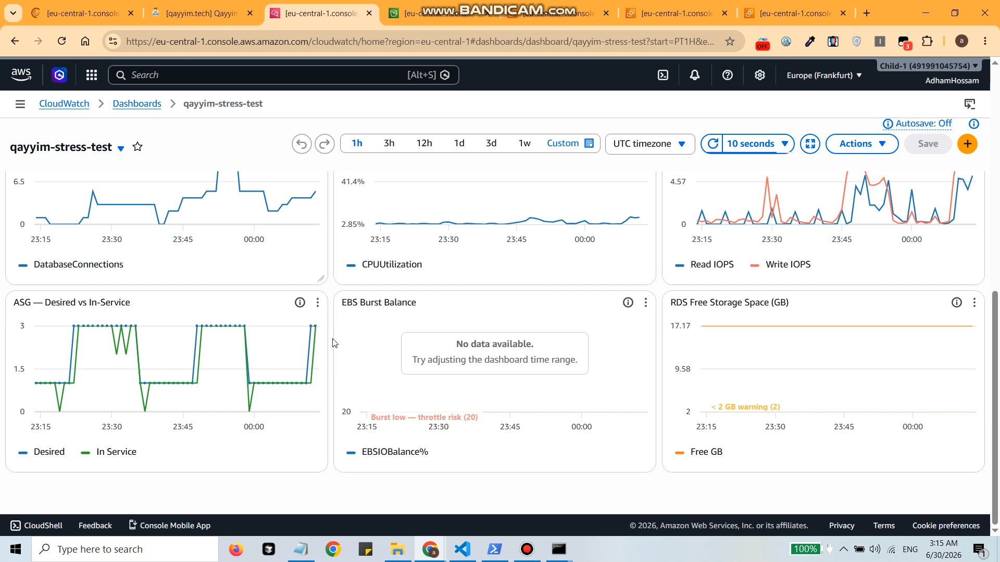
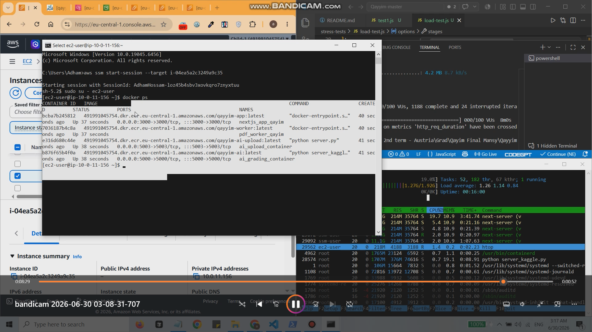
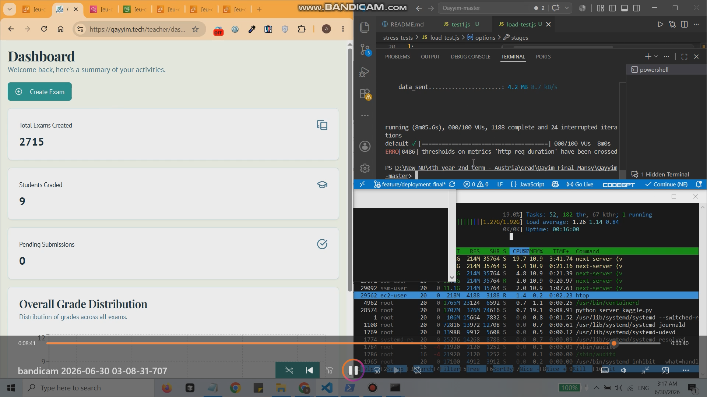

# قَيِّمْ (Qayyim) - AI-Powered Exam Greading (Production-Grade AWS Infra)

> AI-powered automated exam grading system, migrated from a single Docker Compose EC2 to a production-grade AWS architecture with VPC isolation, ALB/ASG auto-healing, managed data layer, and edge delivery via CloudFront.

**Live:** [qayyim.tech](https://qayyim.tech) · **App Repo:** [github.com/adham51/Qayyim](https://github.com/adham51/Qayyim)

---

## Table of Contents

1. [Architecture Overview](#architecture-overview)
2. [Tech Stack](#tech-stack)
3. [Phase-by-Phase Build Order](#phase-by-phase-build-order)
4. [Application Services](#application-services)
5. [Production Incidents & Lessons Learned](#production-incidents--lessons-learned)

---

## Architecture Overview

AWS Infrastructure

Application

---

## Tech Stack

| Layer | Service | Notes |
|---|---|---|
| DNS | Route 53 | Migrated from Hostinger; ALIAS records for apex domain |
| CDN / Edge | CloudFront + WAF | Static asset caching, managed rule sets, rate limiting |
| SSL | ACM | Two certs: eu-central-1 (ALB) + us-east-1 (CloudFront) |
| Load Balancer | ALB | HTTP→HTTPS redirect, health checks on `/api/health` |
| Compute | EC2 t.2small + ASG | Amazon Linux 2023, Docker Compose, IMDSv2 enforced |
| Container Registry | ECR | 4 repos: app, ai-grading, ai-upload, worker |
| Database | RDS MySQL 8.0 | Prisma ORM, automated backups, private subnet |
| Cache / Queue | ElastiCache Redis 7 Serverless | BullMQ job queues, TLS enforced |
| Object Storage | S3 | PDF uploads, pre-signed URLs |
| Secrets | Secrets Manager | All credentials injected to `.env` at EC2 boot |
| Access | SSM Session Manager | No open port 22 required |
| IaC | Terraform | Multi-env replication (prod/dev) |
| EKS | Migration in progress|

### Frontend

- **Next.js 15.3.3** - React framework with App Router
- **TypeScript 5** - Type-safe development
- **Tailwind CSS** - Modern styling
- **Shadcn/ui** - Beautiful UI components

### Backend

- **Next.js API Routes** - Serverless API endpoints
- **MySQL** - Relational database
- **Prisma ORM** - Type-safe database access
- **Zod 3.24.2** - Schema validation
- **JWT + bcrypt** - Authentication & authorization

---

## Performance & Infrastructure Stress Testing

To evaluate infrastructure elasticity, auto-healing, and backend processing capabilities under heavy load, the platform was subjected to an automated **k6** stress test. The test simulated 100 concurrent Virtual Users (VUs) executing real-world authenticated workflows, including JWT authentication, dashboard data fetching, exam creation, and multipart PDF submission uploads.

### Test Metrics & Summary

| Metric | Pre-Test Baseline | Peak / Test Outcome | Notes |
|---|---|---|---|
| **Active Users (VUs)** | 0 | **100 Concurrent VUs** | Ramped over an 8-minute duration |
| **Total HTTP Requests** | 0 | **7,444 Requests** | ~15.33 requests/sec average throughput |
| **Request Success Rate** | 100% | **99.79% Success** | 7,428 passed / 16 failed |
| **ASG Instance Count** | 1 Node (`InService`) | **3 Nodes (`InService`)** | Scaled automatically on >70% CPU alarm |
| **Database Payload** | 2,238 Exams | **2,715 Exams (+477)** | Verified real-time persistence in RDS/S3 |
| **Network Payload** | 0 MB | **347 MB Received / 4.2 MB Sent** | High inbound due to concurrent PDF uploads |
| **Response Latency** | ~120ms | **p(90)=5.87s / p(95)=9.88s** | Identified backend processing bottleneck under load |

---
## Performance & Infrastructure Stress Testing

Validated infrastructure elasticity and backend resilience using **k6** to simulate **100 concurrent users** (VUs) executing authenticated workflows and dynamic PDF uploads over an 8-minute window. The test simulated 100 concurrent Virtual Users (VUs) executing real-world authenticated workflows, including JWT authentication, dashboard data fetching, exam creation, and multipart PDF submission uploads.

### Test Metrics & Summary

| Metric | Pre-Test Baseline | Peak / Test Outcome | Notes |
|---|---|---|---|
| **Active Users (VUs)** | 0 | **100 Concurrent VUs** | Ramped over an 8-minute duration |
| **Total HTTP Requests** | 0 | **7,444 Requests** | ~15.33 requests/sec average throughput |
| **Request Success Rate** | 100% | **99.79% Success** | 7,428 passed / 16 failed |
| **ASG Instance Count** | 1 Node (`InService`) | **3 Nodes (`InService`)** | Scaled automatically on >70% CPU alarm |
| **Database Payload** | ~2,200 Exams & PDFs | **2,715 Exams (+477)** | Verified real-time persistence in RDS/S3 |
| **Network Payload** | 0 MB | **347 MB Received / 4.2 MB Sent** | High inbound due to concurrent PDF uploads |
| **Response Latency** | ~120ms | **p(90)=5.87s / p(95)=9.88s** | Identified backend processing bottleneck under load |

---

### Load Test Lifecycle & Results

#### 1. Baseline State & Test Ramping
Initial state with **~2,200 exams/PDFs** in RDS MySQL and S3, served by 1 active EC2 instance.

#### 2. CloudWatch Telemetry & ASG Scale-Out
At peak 100 VU load, ALB traffic hit **169 RPS** and CPU breached 70%, triggering ASG step-scaling from **1 to 3 EC2 instances**.

#### 3. Containers created successfully on new instances
Newly created instance successfully created 4 containers that are actively running the app

#### 4. Real-Time Data Persistence
Post-test dashboard verified exam count reached **2,715**—successfully processing **477 new exams and PDF uploads** to RDS/S3 with zero data loss.

---

## Phase-by-Phase Build Order

### Phase 1 — Networking

Create in this order: VPC → Internet Gateway → 4 subnets (2 public, 2 private across 2 AZs) → NAT Gateway (in public subnet) → 2 route tables (public → IGW, private → NAT).

Key things:
- Enable DNS hostnames + DNS resolution on the VPC — required for RDS and ECR endpoint resolution
- NAT Gateway must go in a **public** subnet with an Elastic IP
- Private subnets route `0.0.0.0/0` to the NAT, not the IGW

---

### Phase 2 — Security Groups & IAM

Create 5 SGs in this order (they reference each other, so order matters):

| SG | Key inbound rule |
|---|---|
| `qayyim-sg-alb` | 80, 443 from internet |
| `qayyim-sg-bastion` | 22 from your IP only |
| `qayyim-sg-app` | 3000 from ALB SG · 22 from bastion SG |
| `qayyim-sg-rds` | 3306 from app SG only |
| `qayyim-sg-redis` | 6379 from app SG only |

IAM Role `qayyim-ec2-role` — attach: `AmazonSSMManagedInstanceCore`, `AmazonEC2ContainerRegistryReadOnly`, `SecretsManagerReadWrite`, `AmazonS3FullAccess`.

---

### Phase 3 — Data Layer

**RDS MySQL** — place in a DB subnet group using both private subnets. Disable public access. Let RDS manage the password in Secrets Manager via the checkbox during creation.

**ElastiCache Redis Serverless** — easy to accidentally create in the wrong VPC since the VPC selector is buried. Explicitly set the VPC and security group in the Connectivity section. VPC cannot be changed after creation.

**S3** — bucket for PDF uploads. Public read via bucket policy for file downloads. CORS configured for pre-signed URL uploads from the frontend.

---

### Phase 4 — Secrets & Certificates

**Secrets Manager** — store all sensitive env vars as a single secret (`qayyim/prod/app`). Store `DATABASE_URL` as a complete pre-built connection string, not assembled from parts — RDS auto-rotated passwords contain special characters that break URL construction at runtime.

**ACM** — two certificates required for the same domain:
- `eu-central-1` → attached to ALB
- `us-east-1` → attached to CloudFront (hard AWS requirement, no exceptions)

With Route 53, validation is one click ("Create record in Route 53" button).

---

### Phase 5 — Compute: EC2 + ASG + ALB

**Launch Template** — AMI: Amazon Linux 2023 (SSM agent + AWS CLI pre-installed). Set IMDSv2 hop limit to `2` — required for Docker containers to reach instance metadata for IAM role credentials.

User data script runs on every fresh instance boot - file located here: > 🛠️ **User Data Script:** The EC2 boot script that installs Docker, pulls secrets, and spins up the containers is located here: [`user-data.sh`](./Terraform-Qayyim\user_data.sh).

**Target Group** — type: Instances, port 3000, health check path `/api/health`, grace period 300s.

**ALB** — internet-facing, both public subnets, HTTP:80 redirects to HTTPS:443.

**ASG** — both private subnets, attach to target group, health check type: ELB, grace period 300s, desired 1 / max 2.

---

### Phase 6 — Edge: CloudFront + WAF

**CloudFront** — origin is the ALB DNS name. Cache `/static/*` and `/_next/static/*`. Pass through `/api/*` uncached. Attach the us-east-1 ACM cert and custom domain.

**WAF** — AWS Managed Rules (Common Rule Set + Known Bad Inputs) + rate limiting rule. Associate with the CloudFront distribution.

**Route 53** — after CloudFront is created, point both `qayyim.tech` and `www.qayyim.tech` as ALIAS records to the CloudFront distribution domain.

---

### Phase 7 — IaC

**Terraform** — modular structure (`modules/vpc`, `modules/rds`, etc.) with separate `envs/prod` and `envs/dev` var files. S3 + DynamoDB backend for state locking.

---

## Application Services

| Container | Port | Role |
|---|---|---|
| `nextjs_app_qayim` | 3000 | Next.js frontend + API routes + Prisma ORM |
| `ai_grading_container` | 5000 | Flask — RAG grading (ChromaDB + LangChain + Qwen 2.5-7B) |
| `ai_upload_container` | 5003 | Flask — OCR extraction, vector store ingestion |
| `pdf_worker_qayim` | — | Node.js BullMQ worker, consumes `{pdf-processing}` queue |

All four containers share a Docker bridge network on the EC2. Next.js calls Flask services via `localhost` — not Docker service names — since they bind to all interfaces.

---

## Production Incidents & Lessons Learned

### 1. ASG Infinite Launch-Terminate Loop

**Problem:** ASG kept launching instances, failing health checks, and terminating in a loop. This rapidly consumed EC2 hours.

**Root cause:** Private subnet EC2 instances had no outbound internet because the NAT Gateway had not been created. They could not pull images from ECR, retrieve secrets from Secrets Manager, contact SSM, or finish startup. Port `3000` never opened, the ALB marked targets unhealthy, and ASG continuously replaced them.

**Solution:** Set ASG desired capacity to `0` to stop the loop. Created the NAT Gateway, added the private-subnet default route, then restored desired capacity to `1`.

**Lesson:** NAT Gateway or equivalent VPC endpoints are a hard dependency for private instances using ECR, Secrets Manager, SSM, package installs, and external APIs. Validate outbound connectivity before launching the ASG.

---

### 2. ASG Replacement Loop After Reducing Health Check Grace Period

**Problem:** Even with desired capacity set to `1`, ASG temporarily created multiple instances and repeatedly replaced instances during startup.

**Root cause:** Health check grace period was reduced from `300` to `120` seconds. New instances needed to boot, run user data, pull several Docker images, start Next.js, AI, upload, and worker containers, then pass ALB health checks. ASG started trusting ELB health results before startup completed, marked targets unhealthy, and launched replacements. Launch-before-terminate behavior caused temporary extra instances.

**Solution:** Increased ASG health check grace period back to `300–360` seconds. This lets the full container stack start before ASG acts on failed EC2/ELB health checks.

**Lesson:** Health check grace period does not delay ALB checks; ALB checks continue at its configured interval. It only controls how long ASG ignores unhealthy results for a new instance. Set it based on measured end-to-end startup time.

---

### 3. Scaling + k6 + Step Scaling + Grace Period Behavior

**Problem:** During a k6 test (~100 users), Target Tracking did not scale fast enough. At the same time, scaling policies behaved inconsistently and needed tuning. Additionally, ASG behavior during startup was affected by grace period timing.

**Root cause:** Target Tracking is not instant—it depends on CloudWatch CPU datapoints, evaluation delay, EC2 launch time, Docker image pulls, container startup, and ALB health checks. Step Scaling also had misconfigured interval bounds, causing delayed or uneven scale-out. Grace period configuration also affects when ASG reacts to health evaluation during startup.

**Solution:** Extended k6 test to ~11 minutes to cover full scaling lifecycle. Kept Target Tracking at 60% CPU for normal load and added Step Scaling for spikes:

- Alarm: CPU > 50% for 1 x 60-second period  
- Action: Add 2 instances  
- MetricIntervalLowerBound: 0  

**Lesson:** Load tests must cover full scaling lifecycle, not just generate load. Use Target Tracking for steady state and Step Scaling for fast spike response, and always validate scaling policies end-to-end. Grace period must also be considered as part of scaling behavior.

---

### 4. AWS WAF Blocking PDF Uploads

**Problem:** PDF uploads through CloudFront returned `403 Forbidden` with `x-cache: Error from cloudfront`. Requests were blocked before reaching the backend.

**Root cause:** AWS WAF was attached to CloudFront and included managed rule groups such as `AWSManagedRulesCommonRuleSet`, `AWSManagedRulesKnownBadInputsRuleSet`, and `AWSManagedRulesAmazonIpReputationList`. Multipart/form-data uploads or PDF contents triggered a managed-rule false positive.

**Temporary solution:** Changed the managed rule groups from `Block` to `Count` mode. Uploads reached the backend while WAF continued logging which rules would have blocked them.

**Production solution:** Create a high-priority rule named `AllowUploadEndpointBypass` above AWS Managed Rule Groups. Allow only `POST` requests to the exact upload endpoint, such as `/api/v1/teacher/student-submission`. This bypasses managed-rule inspection only for valid upload traffic while managed rules remain in `Block` mode for all other routes.

**Lesson:** Test file uploads through the full CloudFront + WAF path early. Use WAF sampled requests to identify the exact managed sub-rule before creating a narrow exception.

---

### 5. The 3000-Second Split-Brain

**Problem:** During an instance refresh, the ALB routed traffic to both an old broken instance and a new fixed instance. Browser refreshes produced inconsistent results.

**Root cause:** ASG health check grace period was set to `3000` seconds. The ALB marked the new instance healthy, but ASG ignored health results for 50 minutes and retained the old broken instance. Both remained registered and served traffic.

**Solution:** Reduced grace period to `300` seconds and manually terminated the old instance to force a clean cutover.

**Lesson:** Grace period means “how long ASG ignores health results,” not “how long before ALB begins checking.” Excessively large values can keep broken instances serving traffic.

---

### 6. ElastiCache Created in the Wrong VPC

**Problem:** Redis was created in the default VPC, while application servers ran in the production VPC. Every Redis operation timed out.

**Root cause:** ElastiCache Serverless defaults were used and the VPC selector was missed during creation.

**Solution:** Deleted and recreated Redis while explicitly selecting the correct VPC, subnets, and security group. VPC placement cannot be changed after creation.

**Lesson:** Verify VPC, subnet, and security group for every managed AWS service before creation.

---

### 7. S3 `Resolved credential object is not valid` — Three-Part Fix

**Problem:** The application UI loaded, but every PDF upload failed with an AWS SDK S3 credential error.

**Root causes — IMDSv2 hop limit:** Docker containers are one network hop away from the EC2 host. IMDSv2 hop limit was `1`, so containers could not retrieve EC2 role credentials.

**Solution:** Updated the Launch Template metadata hop limit from `1` to `2`.

**Root causes — hardcoded credentials block:** The S3 client explicitly set `accessKeyId` and `secretAccessKey`. This overrode the AWS SDK default credential chain and passed undefined values when no `.env` credentials existed.

**Solution:** Removed the explicit credentials block and allowed the SDK to use its default provider chain.

**Root causes — startup validation:** Application validation required `AWS_ACCESS_KEY_ID` and `AWS_SECRET_ACCESS_KEY`, even though EC2 IAM roles do not require them.

**Solution:** Removed those keys from required environment variables.

**Lesson:** On EC2, use IAM roles and the AWS SDK default credential chain. Do not hardcode credentials or require environment keys that are unnecessary with instance roles.

---

### 8. Auto-Rotated RDS Password Breaking `DATABASE_URL`

**Problem:** After Secrets Manager rotated the RDS password, newly launched ASG instances could not connect to the database. Existing instances continued working.

**Root cause:** User data assembled `DATABASE_URL` from separate secret values. The rotated password contained reserved URL characters such as `[`, `]`, `:`, and `@`, which broke connection-string parsing because `jq` does not URL-encode values.

**Solution:** Stored `DATABASE_URL` as one complete URL-encoded connection string in Secrets Manager. User data now writes it directly without assembling values at boot.

**Lesson:** Store complete connection strings as a single secret. Test a fresh ASG launch after password rotation because existing database connections can hide boot-time failures.

---

### 9. RDS Proxy Created by Accident

**Problem:** RDS Proxy began provisioning during database creation, adding approximately `$11/month` with no benefit for the project scale.

**Root cause:** The RDS Proxy option was accidentally enabled in Additional Configuration.

**Solution:** Deleted the proxy immediately from RDS → Proxies.

**Lesson:** Review all creation-form sections before submitting. AWS consoles include optional paid features throughout the workflow.

---

### 10. SSM Session Manager Offline Despite Correct IAM Role

**Problem:** SSM Agent appeared offline on private-subnet EC2 instances even though `AmazonSSMManagedInstanceCore` was attached.

**Root cause:** SSM Agent requires outbound HTTPS access to AWS Systems Manager endpoints. Private instances had no NAT Gateway yet.

**Solution:** Creating the NAT Gateway restored SSM connectivity within minutes.

**Lesson:** SSM, ECR, Secrets Manager, package managers, and many AWS APIs require outbound access from private instances through NAT Gateway or VPC endpoints.
